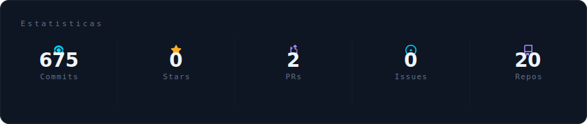

<!-- Galaxy Profile README Template
     Customize this file with your own info, then rename it to README.md
     in your GitHub profile repo (github.com/YOUR_USERNAME/YOUR_USERNAME).
     The SVG paths below point to assets/generated/ which are auto-generated
     by the GitHub Actions workflow or by running: python -m generator.main -->

  
  
  

 
 

  

 

  

 

  

 

  

 

 

